<div align="center">


# Kai's Flow

**One person's whole life in one app, for $0 a month.**

Tasks, calendar, habits, rituals, journal, people and reading, in one installable app that syncs between laptop and phone,<br/>
works offline, and files what you say into the right place.


-8e74d0?style=flat-square)


[**Tour**](#-a-tour) · [**Features**](#-what-it-does) · [**The garden**](#-every-plant-is-a-number) · [**Architecture**](#%EF%B8%8F-how-it-works) · [**Self-host**](#-self-hosting) · [**Develop**](#%EF%B8%8F-development) · [**Roadmap**](#%EF%B8%8F-roadmap)

<br/>

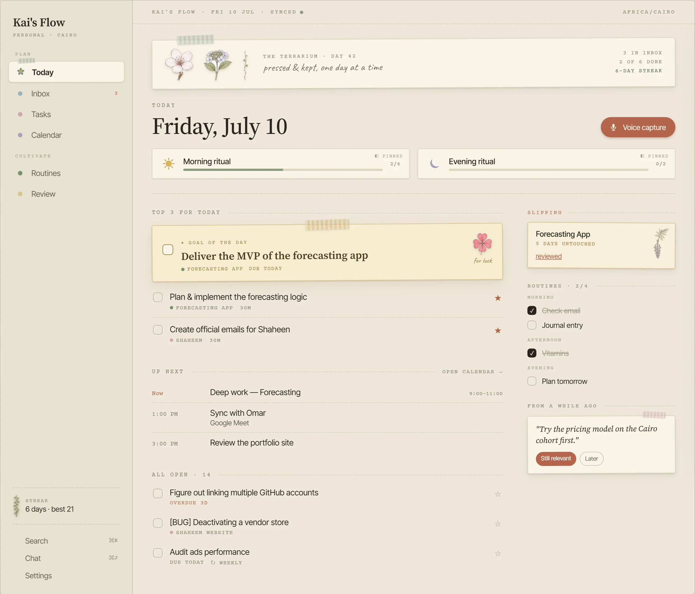

<sub>Today, the home screen: Top 3, what's next on the calendar, today's routines, what's slipping, and one old note brought back.</sub>

</div>

---

## Why this exists

I paid for [Akiflow](https://akiflow.com) (~$19–34/month) to get one inbox, a fast command bar and a calendar I could drag tasks onto. My journal, habits, people and reading lived in four other apps. Then I watched Jerad Hill build an AI life dashboard with voice capture, streaks, a personal CRM and a "what's slipping" view, and it did the half Akiflow didn't.

**Kai's Flow is both, in one app.** It is a full Akiflow replacement that also covers the rest of a life, and it has to stay:

| | The rule | What it means in practice |
| :-- | :-- | :-- |
| 🪶 | **Light** | Nothing runs on the laptop but a browser tab: no Electron, no local models, no background processes. Scheduled work runs on Supabase's servers (`pg_cron` + edge functions). |
| 🆓 | **Free** | $0/month on every service, and nothing on the free tiers asks for a credit card. [The cost table](#-privacy-cost-and-trust) shows it. |
| 🔄 | **Everywhere** | Laptop and phone run the same build and see the same data live. Works offline; queued writes sync when you're back. |
| 🔐 | **Private** | Journal and personal text only go to Groq, which doesn't train on API data. API keys stay on the server. |
| ⚡ | **Fast to capture** | Anything you think of reaches the inbox in one keystroke or one tap of the mic. |

---

## 🌿 A tour

<table>
<tr>
<td width="50%">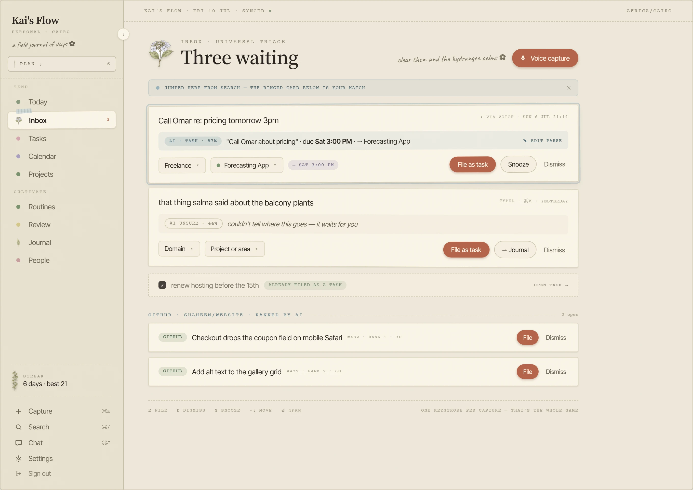</td>
<td width="50%">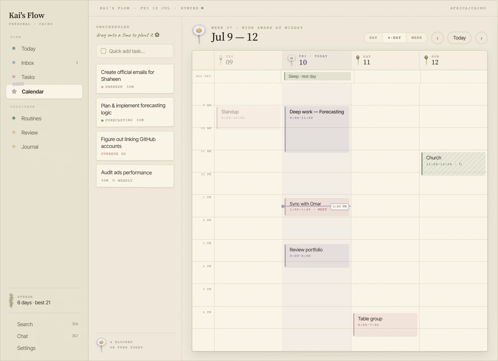</td>
</tr>
<tr>
<td><b>Inbox.</b> Speak or type, and the AI suggests a kind, project, date and confidence score. Captures below 75% confidence wait here for you instead of being guessed. Triage from the keyboard: <kbd>e</kbd> file · <kbd>d</kbd> dismiss · <kbd>s</kbd> snooze.</td>
<td><b>Calendar.</b> Our own time grid, not an embedded Google widget. Drag a task from the Unscheduled rail onto the grid to block time for it. Day, N-day, week and month views, with a live "now" line.</td>
</tr>
<tr>
<td>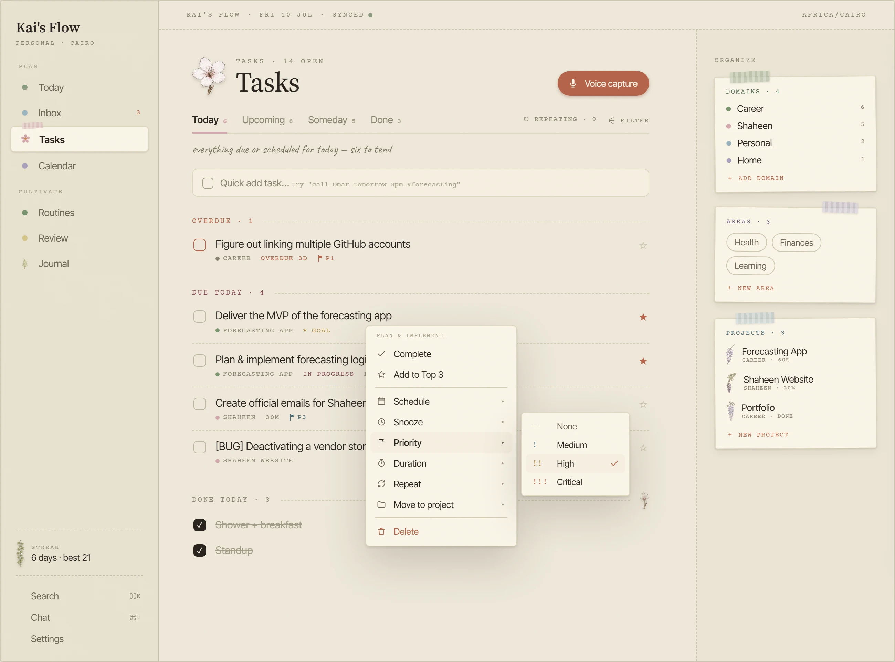</td>
<td>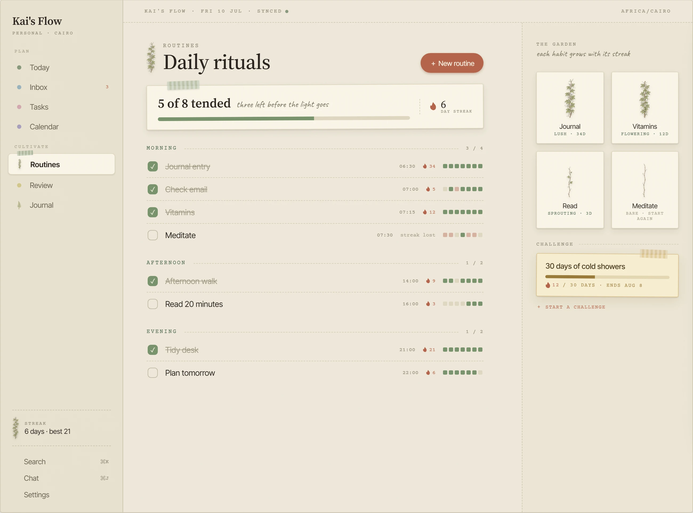</td>
</tr>
<tr>
<td><b>Tasks.</b> Smart lists, durations, priorities (<code>!</code> <code>!!</code> <code>!!!</code>), repeats, subtasks, snooze, bulk select and nested menus. Domains → Areas → Projects can be renamed and re-parented freely.</td>
<td><b>Routines.</b> Habits are kept separate from tasks and grouped by time of day. Each has a streak, a 7-day history strip and a vine that grows as the streak does. You can add temporary challenges too.</td>
</tr>
</table>

<table>
<tr>
<td width="33%" align="center">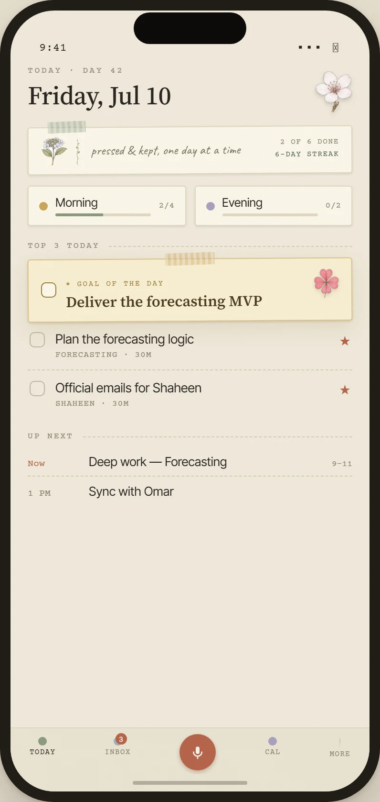</td>
<td width="33%" align="center">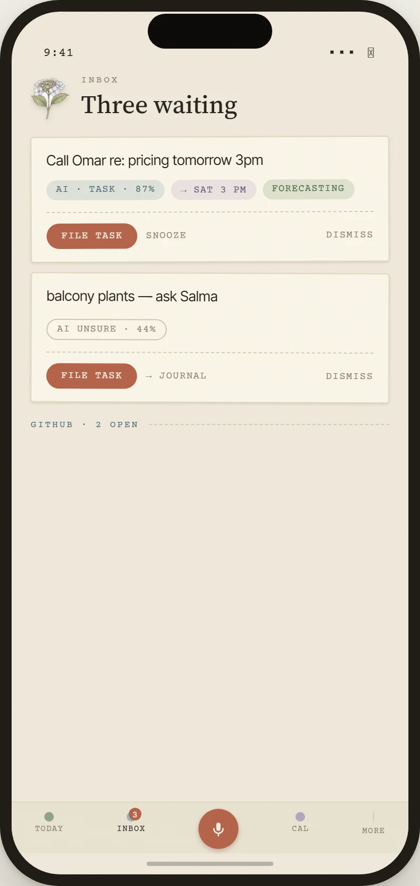</td>
<td width="33%" align="center">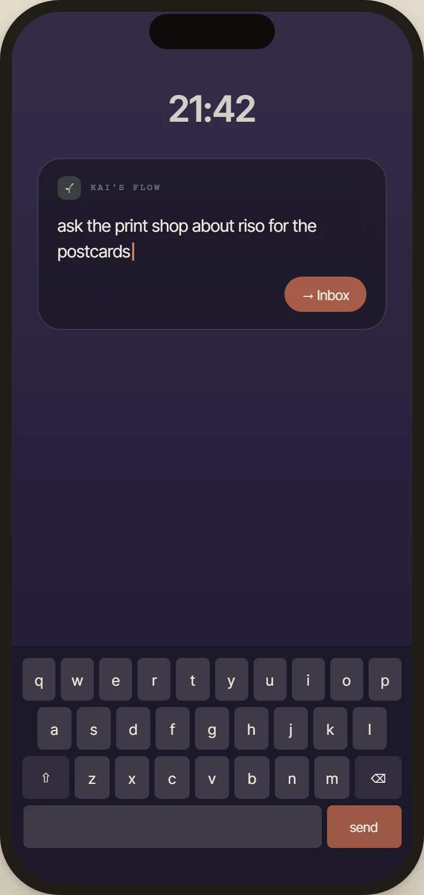</td>
</tr>
<tr>
<td align="center"><sub><b>The same app on your phone.</b> Add it to the home screen and it installs.</sub></td>
<td align="center"><sub><b>Triage on the go.</b> One tap to file.</sub></td>
<td align="center"><sub><b>Quick capture.</b> One field, sent straight to the inbox.</sub></td>
</tr>
</table>

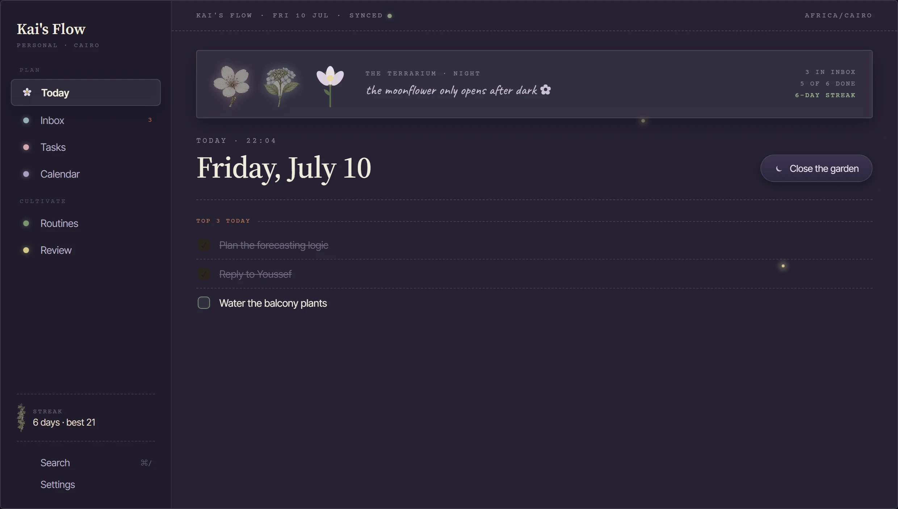

<p align="center"><sub><b>Night theme.</b> After dark the palette switches to plum, the moonflower opens, and Today's main button becomes <i>Close the garden</i>, which starts the evening shutdown.</sub></p>

> [!NOTE]
> These screenshots come from the **design export** ([`design-export/*.dc.html`](design-export/)) that the live UI is built against pixel for pixel. It uses sample data because the real instance holds a real person's life. Open any `.dc.html` file in a browser to see the full spec for that screen, with every state, breakpoint and theme.

---

## ✨ What it does

✅ shipped and in daily use · 🌱 being integrated or polished · 🗓 planned

### Capture: get it out of your head

- ✅ **Command bar** (<kbd>Ctrl</kbd> <kbd>K</kbd>). Type `call Omar tomorrow 3pm 30m !! #forecasting`. `chrono-node` reads the date instantly, and duration, priority and project are parsed inline with live chips. <kbd>Enter</kbd> quick-adds it; <kbd>Ctrl</kbd> <kbd>Enter</kbd> sends it through AI capture.
- ✅ **Voice capture.** The mic records with `MediaRecorder`, Groq Whisper (`whisper-large-v3-turbo`) transcribes, and the AI parse files it. Works from the phone's home screen.
- ✅ **AI filing with a confidence gate.** A JSON-schema-constrained Groq call returns `{kind, cleaned_text, project, due, duration, priority, confidence}`. At ≥ 0.75 it files the item automatically. Below that it stays in the Inbox rather than guessing wrong.
- ✅ **Universal Inbox.** One triage queue with snooze, multi-select, bulk actions and a "Dismissed" pile that clears itself after 30 days.
- ✅ **Import.** Akiflow export and generic CSV importers. Re-importing is safe because every row carries an `external_ref`, so a second run adds no duplicates. Tested on a real 655-task Akiflow account.

### Plan: decide what today is for

- ✅ **Today.** Top 3 (one of them the Goal of the Day), what's next on the calendar, today's routines, what's slipping, and one resurfaced memory.
- ✅ **Tasks and smart lists.** Today / Upcoming / Someday / Done, overdue grouping, durations everywhere, priorities, repeats (`rrule`), subtasks, per-task reminders, star-to-Top-3, keyboard triage, <kbd>Ctrl</kbd> <kbd>A</kbd> with bulk actions, and undo toasts.
- ✅ **Calendar time-blocking.** Built on FullCalendar's time grid inside our own component. Drag tasks onto the grid, resize to change duration, right-click empty space to add an event there, and switch between Day · N-day · Week · Month.
- ✅ **Planning board.** An Upcoming board you can view as Overview, Day, Week or Month columns. Drag a card to another column to reschedule it.
- ✅ **Rituals.** Guided morning (review → pick Top 3 → clear inbox → block the day), evening shutdown and weekly review flows.
- ✅ **Focus.** A focus timer with a mini floating widget and time tracking against tasks.

### Tend: keep a life from drifting

- ✅ **Routines, streaks and challenges.** Morning, afternoon and evening buckets with custom times and ordered steps, 7- and 30-day completion rates, and time-boxed challenges.
- ✅ **Slipping.** Flags projects and areas you haven't touched in a while, computed from the activity log.
- ✅ **Push notifications.** Morning digest, evening nudge, overdue tasks and task reminders, sent through Web Push by `pg_cron`. No paid notification service involved.
- ✅ **Projects, areas and domains.** Project pages with milestones and % complete, plus areas and domains you can rename and merge at any time.
- 🌱 **Journal, Library, People.** Multi-entry journal, notes and quotes, and a personal CRM. Built, and currently being brought up to the design export.

### Remember: ask your own life questions

- ✅ **Search** (<kbd>Ctrl</kbd> <kbd>/</kbd>). Hybrid keyword and semantic search that merges Postgres full-text and pgvector results with reciprocal rank fusion. No LLM call needed.
- ✅ **Chat** (<kbd>Ctrl</kbd> <kbd>J</kbd>). Ask questions about your own data. It retrieves the relevant rows, streams an answer from Groq and cites the tasks and captures it used.
- ✅ **Resurfacing.** Once a day it picks an old capture or note at random (weighted) and puts it on Today, where you can turn it into a task, keep it for later, or let it go.
- ✅ **Activity and Herbarium.** A log of everything you did, and an archive where finished projects are kept as pressed flowers you can restore.

### Coming

- 🗓 **GitHub issues → Inbox**, ranked by AI (P6)
- 🗓 **Optional Google Calendar mirror** running invisibly in the background. The calendar you see is always ours.
- 🗓 **Desktop and Android builds with Tauri** alongside the PWA
- 🗓 **Content pipeline, retainers, Kindle highlights** (P7)

---

## 🌸 Every plant is a number

The botanical art does a job. **Every illustration shows a real value**, and one shared module ([`lib/growthStages.ts`](app/src/lib/growthStages.ts)) sets the thresholds so no two screens can disagree about which stage a plant is in. You can read your state without reading any text.

| | Plant | Lives on | It shows | Stages |
| :-: | :-- | :-- | :-- | :-- |
|  | **Hydrangea** | Inbox | how much is waiting | `zero` 0 · `light` 1–4 · `medium` 5–19 · `heavy` 20+ |
| 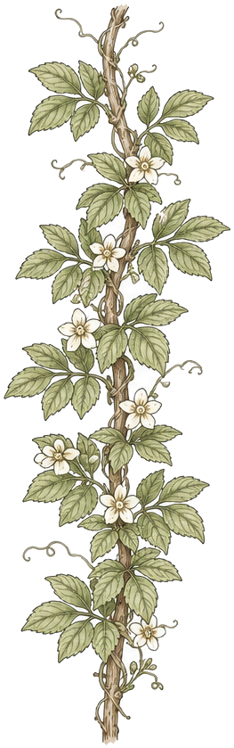 | **Vine** | Routines | your streak | `bare` 0 · `sprouting` 1–6 d · `flowering` 7–29 d · `lush` 30+ d |
|  | **Cherry** | Tasks, Today | today's progress | `bud` → `opening` → `bloom` → `fallen` (all done) |
|  | **Daisy** | Calendar headers | the time of day | `past` · `morning` <11 · `midday` 11–16 · `evening` · `future` |
|  | **Fern** | Journal, Library | how far along | `coil` → `unfurl` → `full` (by entry length or % read) |
|  | **Wisteria** | Projects | milestone completion | `p0` → `p100` in 20% steps |
|  | **Clover** | Goal of the Day | luck for the one thing that matters | |

It all runs on one design system: paper texture, washi tape, Source Serif 4, Inter Tight, Courier Prime and Caveat (all self-hosted so the app starts offline), a day and a night palette defined as tokens, and a motion layer that honours `prefers-reduced-motion`. Emoji render as self-hosted Twemoji so they look the same on Windows, Android and macOS. Full spec: [`docs/DESIGN_SYSTEM.md`](docs/DESIGN_SYSTEM.md) and the export's [`Design System.dc.html`](design-export/Design%20System.dc.html).

---

## ⌨️ Keyboard first

Everything has a key. Press <kbd>?</kbd> anywhere for the cheatsheet. It only lists bindings that actually exist, because it's built from the same tables the handlers use ([`lib/shortcuts.ts`](app/src/lib/shortcuts.ts)).

<table>
<tr><th>Anywhere</th><th>Task lists</th><th>Inbox</th></tr>
<tr valign="top"><td>

| | |
| :-- | :-- |
| <kbd>Ctrl</kbd> <kbd>K</kbd> | Command bar |
| <kbd>Ctrl</kbd> <kbd>/</kbd> | Search |
| <kbd>Ctrl</kbd> <kbd>J</kbd> | Chat |
| <kbd>n</kbd> | New task |
| <kbd>?</kbd> | Cheatsheet |
| <kbd>Esc</kbd> | Close overlay |

</td><td>

| | |
| :-- | :-- |
| <kbd>j</kbd> <kbd>k</kbd> | Move |
| <kbd>e</kbd> | Complete |
| <kbd>t</kbd> | Toggle Top 3 |
| <kbd>1</kbd> <kbd>2</kbd> <kbd>3</kbd> | Today · Tomorrow · Next week |
| <kbd>s</kbd> / <kbd>p</kbd> | Snooze / Move to project |
| <kbd>x</kbd> / <kbd>#</kbd> | Select / Delete |

</td><td>

| | |
| :-- | :-- |
| <kbd>↑</kbd> <kbd>↓</kbd> | Move |
| <kbd>e</kbd> | File with AI suggestion |
| <kbd>d</kbd> | Dismiss |
| <kbd>s</kbd> | Snooze |
| <kbd>↵</kbd> | Edit title |

</td></tr>
</table>

**Command bar grammar:** `<title> [date/time] [30m | 1h30m] [! | !! | !!!] [#project]`. Everything except the title is optional, and the tokens are removed from the title when the task is created.

---

## ⚙️ How it works

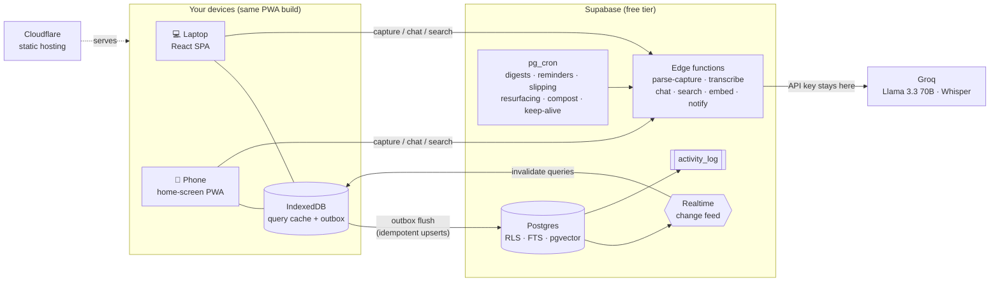

**Three decisions shape everything else:**

1. **Offline-first with an outbox, the way Akiflow's mobile app works.** Every row gets a client-generated UUID. Writes update the local cache immediately and go into an IndexedDB outbox, which flushes to Supabase whenever you're online. Retries are idempotent upserts, and conflicts resolve last-write-wins on `updated_at`. With one user there's no need for CRDTs. The other device finds out through Realtime and refreshes. All writes go through one helper: [`lib/outbox.ts`](app/src/lib/outbox.ts).
2. **One event log feeds every derived feature.** Every module writes domain events (`task.completed`, `routine.checked`, …) to a single `activity_log` table. Slipping, streaks, resurfacing and digests only read that log, so no module imports another module's code.
3. **All AI goes through one server-side proxy.** The client never holds a model key. Edge functions call Groq's OpenAI-compatible API, and the models are set through env vars (`GROQ_PARSE_MODEL`, `GROQ_CHAT_MODEL`, `GROQ_STT_MODEL`), so switching provider means changing config, not code. Embeddings use Supabase's built-in `gte-small` because Groq has no embeddings API.

<details>
<summary><b>The capture pipeline, step by step</b></summary>

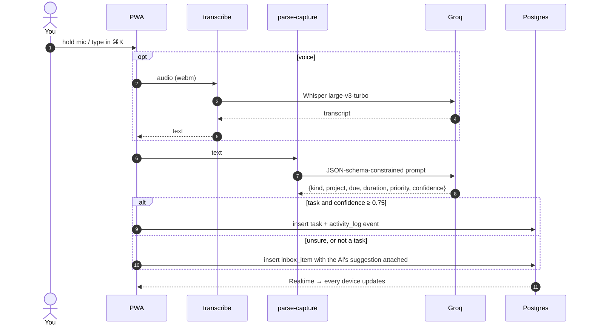

</details>

<details>
<summary><b>Stack</b></summary>

| Layer | Choice |
| :-- | :-- |
| UI | React 19, TypeScript (strict), Vite 8, Tailwind 4, React Router 8 |
| State and data | TanStack Query 5 persisted to IndexedDB, Zustand, Zod (one schema per entity, shared by forms and edge functions) |
| Dates and recurrence | `chrono-node` (natural language), `rrule` (repeats); stored in UTC, shown in the user's time zone |
| Calendar | FullCalendar time grid and day grid, wrapped in our own `CalendarGrid` |
| Drag and drop | `@dnd-kit/core` |
| PWA | `vite-plugin-pwa`: precaches fonts, CSS, JS and art; caches emoji at runtime |
| Backend | Supabase: Postgres with RLS on every table, Auth, Realtime, Storage, Deno edge functions, `pg_cron` + `pg_net`, Vault |
| Search | Generated `tsvector` columns + `vector(384)` embeddings → `search_hybrid()` with RRF |
| AI | Groq (Llama 3.3 70B for parse and chat, Whisper large-v3-turbo for speech) |
| Hosting | Cloudflare static assets, deployed from `master` |
| Quality | Vitest (204 tests), oxlint, `tsc -b` |

</details>

---

## 🔒 Privacy, cost and trust

**What leaves your device, and where it goes:**

| Data | Goes to | Why it's OK |
| :-- | :-- | :-- |
| Everything you store | Your own Supabase project | Row-level security on every table: `user_id = auth.uid()` |
| Text you capture, voice, chat questions | Groq, called from an edge function | Groq doesn't train on API inputs and keeps no data with zero-data-retention turned on. **Gemini's free tier was rejected** for this because Google may train on free-tier inputs. |
| Search embeddings | Nowhere else | Computed inside Supabase with the built-in `gte-small` model |
| API keys (Groq, VAPID, service role) | Supabase secrets and Vault only | Never in client code or any `VITE_` variable. An August 2026 audit found **zero secrets in the bundle or git history**. |

**What it costs:**

| Service | Free tier used | Headroom for one person |
| :-- | :-- | :-- |
| Supabase | 500 MB Postgres, 500k function calls/mo, Realtime, pg_cron | Plenty. A daily `keep-alive` cron stops the free project pausing after 7 idle days. |
| Groq | ~1,000 req/day (70B), ~2,000 transcriptions/day | Far more than one person captures |
| Cloudflare | Static hosting, unlimited bandwidth | Plenty |
| **Total** | | **$0 / month**, and none of it needs a card |

> [!IMPORTANT]
> **Status: personal software, heading toward v1.0.** This is one person's daily driver, built in the open. The [pre-v1.0 security audit](docs/SECURITY-AUDIT-2026-08-01.md) found no hardcoded secrets and no XSS surface, and RLS is correct on every table. Hardening edge-function caller authentication for multi-user use is in progress. If you self-host, treat it as a single-user instance for now.

---

## 🚀 Self-hosting

You need a free [Supabase](https://supabase.com) project, a free [Groq](https://console.groq.com) API key, Node 20+ and the [Supabase CLI](https://supabase.com/docs/guides/cli).

**1. Clone and install**

```bash
git clone https://github.com/khairyKY/kais-flow.git
```

```bash
cd kais-flow/app && npm install
```

**2. Create the database.** Link your project and push every migration (they're numbered and run in order):

```bash
supabase link --project-ref <your-project-ref>
```

```bash
supabase db push
```

> [!WARNING]
> The `pg_cron` migrations (`0006`, `0007`, `0009`, `0016`, …) call edge functions by URL, and that URL points at the original project. Before you push, change `https://<ref>.supabase.co` in those files to your own project's URL. Also store your service-role key in Vault as `service_role_key` so the cron jobs can authenticate.

**3. Set the server-side secrets and deploy the functions**

```bash
supabase secrets set GROQ_API_KEY=<your-groq-key>
```

```bash
supabase functions deploy
```

Optional: `GROQ_PARSE_MODEL`, `GROQ_CHAT_MODEL` and `GROQ_STT_MODEL` override the default models. For push notifications, generate VAPID keys and set `VAPID_KEYS` (the private JWKS) and `VAPID_CONTACT_EMAIL`.

**4. Point the app at your project.** Copy `app/.env.example` to `app/.env`:

```ini
VITE_SUPABASE_URL=https://<your-project-ref>.supabase.co
VITE_SUPABASE_ANON_KEY=<your-anon-key>        # public by design; RLS protects the data
VITE_VAPID_PUBLIC_KEY=<your-vapid-public-key> # optional, only for push
```

**5. Run it**

```bash
npm run dev
```

Open it, sign up (*"Plant your garden"*), and install it from the browser's address bar. On a phone, use **Add to Home Screen**.

**6. Deploy (optional).** `app/wrangler.jsonc` is already set up for Cloudflare's free static hosting:

```bash
npm run build && npx wrangler deploy
```

---

## 🛠️ Development

```bash
cd app && npm run dev
```

| Task | Command (run from `app/`) |
| :-- | :-- |
| Dev server with HMR | `npm run dev` |
| Type-check and production build | `npm run build` |
| Preview the production build (with service worker) | `npx vite preview` |
| Tests | `npx vitest run` |
| Lint | `npm run lint` |
| New migration (repo root) | `supabase migration new <name>` |

<details>
<summary><b>Repository layout</b></summary>

```
kais-flow/
├─ app/                        React PWA
│  ├─ src/features/<feature>/  vertical slices: components, hooks, api, types
│  │    today · inbox · tasks · calendar · capture · command-bar · routines · rituals
│  │    focus · search · chat · resurfacing · slipping · journal · library · people
│  │    projects · areas · domains · import · notifications · herbarium · seasons …
│  ├─ src/lib/                 shared plumbing: outbox, realtime, theme, motion, shortcuts, undo
│  └─ public/ds/assets/        the botanical art (each plant's stages)
├─ supabase/
│  ├─ migrations/              0001 → 0036, schema plus cron jobs
│  └─ functions/               parse-capture · transcribe · chat · search · embed · notify
├─ design-export/              the design source the UI is built against (open *.dc.html in a browser)
└─ docs/
   ├─ ROADMAP.md               where the build is right now (read this first)
   ├─ DATA_MODEL.md            every table, column and RPC
   ├─ DESIGN_SYSTEM.md         tokens, type, motion
   └─ phases/                  a spec and acceptance checklist for each build phase
```

</details>

**House rules.** These keep the codebase small as it grows:

- **Every table** has a client-generated `id uuid`, `user_id default auth.uid()` with RLS, `created_at` and `updated_at` (set by a shared trigger).
- **Every write** goes through the outbox. **Every domain event** goes through `logActivity()`.
- **One Zod schema per entity**, shared by forms and edge functions.
- **Store UTC, render local.** Durations are minutes, everywhere.
- **Phase discipline.** Each phase in [`docs/phases/`](docs/phases/) has a spec and an acceptance checklist, and nothing ships until every item on it has evidence. Ideas outside the current phase get one line in the ROADMAP changelog and wait.

---

## 🗺️ Roadmap

| Phase | What | Status |
| :-- | :-- | :-- |
| P0 | Foundation: auth, PWA shell, sync engine | ✅ |
| P1 | Task core: inbox, command bar, Today, Top 3, hierarchy | ✅ |
| P2 | AI capture: voice, parse, confidence gate, live sync | ✅ |
| P3 | Calendar and time-blocking | ✅ |
| P4 | Routines, streaks, recurring tasks, Slipping, push, rituals | ✅ |
| P5 | AI chat, hybrid search, resurfacing | ✅ |
| Retrofit | Areas, reminders, notification history, then Akiflow-depth UX (smart lists, durations, keyboard layer, planning board) | ✅ |
| P-IMPORT | Akiflow and CSV import | ✅ |
| **Botanical** | **Design export → live UI, hardening, then ship as PWA and Tauri apps** | 🌱 current |
| P6 | Integrations: GitHub issues → Inbox, labels, share target | 🗓 |
| P7 | Life-OS completion, then the Akiflow parity audit and cancelling the subscription 🎉 | 🗓 |

The build's current state, with a dated log of every decision, is in [`docs/ROADMAP.md`](docs/ROADMAP.md). The original research and the full feature parity matrix are in [`PLAN.md`](PLAN.md).

---

## 🙏 Standing on

- **[Akiflow](https://akiflow.com)**: the product being replaced, and the standard for inbox, command bar and time-blocking UX.
- **Jerad Hill**: his AI life dashboard supplied the Slipping metric, voice capture with AI filing, and the lesson that *an unsure AI should leave things in the inbox*.
- **[Twemoji](https://github.com/twitter/twemoji)** by Twitter, licensed [CC-BY 4.0](https://creativecommons.org/licenses/by/4.0/). Self-hosted in `app/public/emoji/`.
- **[FullCalendar](https://fullcalendar.io)**, **[chrono-node](https://github.com/wanasit/chrono)**, **[rrule](https://github.com/jkbrzt/rrule)**, **[TanStack Query](https://tanstack.com/query)**, **[dnd-kit](https://dndkit.com)**, **[Supabase](https://supabase.com)**, **[Groq](https://groq.com)**.
- Type: **Source Serif 4**, **Inter Tight**, **Courier Prime** and **Caveat** (SIL Open Font License), self-hosted through Fontsource.

## ⚖️ License

There's no license file yet, which means all rights are reserved by default. The source is public so you can read it and learn from it. If you want to reuse part of it, [open an issue](https://github.com/khairyKY/kais-flow/issues) and ask.

<div align="center">
<br/>
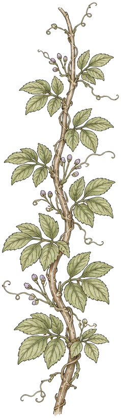
<br/>
<sub><i>pressed & kept, one day at a time</i></sub>
</div>
