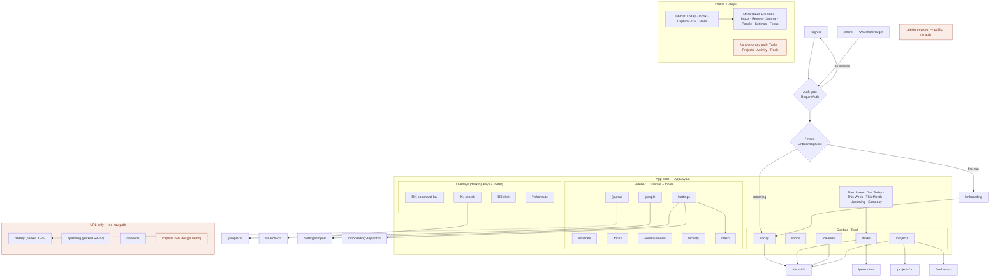

# UI/UX Audit — 2026-09-24

Whole-app UI/UX audit on branch `feature/botanical-integration` @ `941a59a` (FIX-1 landed). The live pass ran on the dev server (`kais-flow-audit`, :5199), signed in to Kai's real account, **read-only: nothing was written to his data.** Checked at 1440×900, 1024×768, 880×900 and 375×812, in the day and night themes, plus source reads for root causes.

**Method:** `design:design-critique` framework (usability · hierarchy · consistency · accessibility). The route map is built from `App.tsx` plus every `navigate()`/`<Link>`; the graphify graph is dated 2026-07-20 and was too stale to use. Contrast, hit-target, overflow and heading checks are scripted DOM measurements, not eyeballed.

**Deduped against:** J-1…J-28 (`design-integration/JUDGING-*.md`), S/B/D/H (`SECURITY-AUDIT-2026-08-01.md`), `FIX-PLAN.md`. Everything below marked **new** is in none of them. Known items that are still visible are listed in §4 and not re-filed.

---

## 1. Site map

27 routes. Three ways to move around on desktop (sidebar, ⌘-overlays, in-page links); one on phone (tab bar + More). There's no PWA shortcut into `/capture`. The manifest only wires `share_target → /share`.

## 2. Overall impression

The botanical system holds together. Every page uses the same header recipe (mono kicker → serif h1 → handwritten sub-line), the voice is consistent, and empty states are designed rather than blank. The biggest opportunities are **not** styling:
- the data Kai sees is partly fabricated (U-1)
- the phone can't reach two core surfaces (U-2)
- the default 125% zoom breaks layout in the half-screen-window band (U-3)
- the day theme's secondary ink fails contrast almost everywhere (U-4)

## 3. Findings — all new

| # | Sev | Surface | Finding (evidence) | Recommendation |
|---|---|---|---|---|
| **U-1** | 🔴 | Journal · Library · Review · People | **Fabricated content lives in Kai's real account.** Migration `0021_journal_library.sql:111` loops `for u in select id from auth.users` and inserts made-up journal entries written in his voice (e.g. "Omar's note about starting with the Cairo cohort…"), plus notes, quotes and books. `0024_time_entries.sql:18` does the same with a fake **"Forecasting App"** project (fixed ids `8888…`/`9999…`), and Weekly Review asks him to sweep it ("Forecasting App · quiet 67 days"). People shows Laila/Mom/Nour/Omar, the same cast as `design-export/People.dc.html`. Punch 2/9 removed the sample *literals* from the UI; the *rows* the migrations seeded are still there. A private journal with entries he never wrote is a trust break. | One cleanup migration: delete the `0024` rows by their fixed ids, and the `0021` rows by exact seeded content. Never seed user tables from a migration again (use `supabase/seed.sql`, local only). **[KAI]** confirm whether the 6 People are real before deleting any of them. **→ 2026-09-24: Kai confirmed all fake.** The live read found them hand-seeded (fixed ids `2000…0001–0006`, 9 interactions, plus "Family"/"Work" domains only they use). Purge written as `supabase/migrations/0035_purge_sample_seed.sql`, which Kai runs. |
| **U-2** | 🔴 | Phone nav | **Tasks, Projects, Activity and Trash have no phone nav path**, verified live at 375px. The More sheet lists Routines · **Inbox** (already a tab) · Review · Journal · People · Settings · Focus. ⌘K doesn't exist on a phone, so Tasks is reachable only via Today's "view all" link, and Projects not at all. | `components/MobileTabBar.tsx:18` `MORE_ITEMS`: replace the duplicate Inbox with **Tasks** and **Projects**, and add Activity. Trash is fine via Settings. It's an array edit. |
| **U-3** | 🔴 | All pages, 768–~1000px | **The default 125% root zoom squeezes the layout in the half-screen band.** At an 880px window the desktop sidebar stays (303px), leaving main 566px. Today's h1 wraps to 3 lines and **"Top 3 for today" overlaps "Slipping"** (reproduced; also visible in the first screenshot of the session). Root cause: media queries don't see root `zoom` (`lib/uiScale.ts:19` says so deliberately), so every breakpoint fires 25% too late. Unrelated to J-5, which the 2026-09-24 FIX-1 session traced to leftover animation transforms rather than zoom. This is zoom's own, directly measured cost. | Make the breakpoint zoom-aware (compare `innerWidth / uiZoom()`), which is easiest after audit D2 folds the 13 `useIsMobile` copies into one, so that band gets the rail or phone chrome. A container query on Today's two-column grid also fixes the overlap locally. |
| **U-4** | 🟡 | App-wide, day theme | **Day-theme secondary text fails WCAG AA at scale:** 106 failing text nodes on Today, 126 on Tasks, 59 on Settings. Night theme: 9 / 9 / 22. Cause: text set in `--ink-faint #8b8471` (2.91:1 on sidebar, 3.45:1 on parchment) and `--ink-hairline #a49d87` (2.12:1; the "Tend"/"Cultivate" labels). Worst cases: the empty ☆ star at **1.39:1**, Tasks tab counts at 1.73:1, Settings helper text at 2.51:1 and 10.6px effective. `--ink-muted #6b6455` passes (4.59:1 / 5.44:1). | Stop using `--ink-faint`/`--ink-hairline` for text; keep them for dots, rules and hairlines. Move those text sites to `--ink-muted` and carry the hierarchy with size and letter-case instead. The value is Kai's visual call; the rule is not. |
| **U-5** | 🟡 | Today · Tasks · Calendar rail | **Task checkboxes have no accessible name.** They're `role="checkbox"` with no `aria-label`: 52 on Today, 411 on Tasks, 69 on Calendar. A screen reader announces "checkbox, not checked" ×411. | Add `aria-label={`Complete "${title}"`}` once, in the shared `.kf-checkbox` button. |
| **U-6** | 🟡 | ~109 sites | **Clickable `span`/`div`s that can't be reached from the keyboard.** A source grep finds about 109 `onClick` handlers on elements with no role. That includes the calendar's ‹ Today › controls (`CalendarPage.tsx:528-529`) and Focus's Pomodoro/Stopwatch toggle. Real `<button>`s do show a focus ring, so the gap is only these. Worst files: LibraryPage 13, PersonDetailPage 10, Trash 8, Herbarium 8, NewRoutineForm 7. | Convert to `<button type="button">`, starting with the calendar nav, the Focus mode toggle and Trash's rows. Leave scrim/backdrop clicks as they are. |
| **U-7** | 🟡 | `/tasks` | **Tasks renders every row, with no windowing.** 411 rows, 6,196 DOM nodes and 287 emoji ``s make a page 31,000px tall. First frame took 1.6s on the dev server, and screenshots timed out on it. The dev build exaggerates this, but the shape is the same in production. (H2 is about *truncation* at 1000 rows; this is render cost.) | Cap each list at 50 with "show more", as Today already does, or open `/tasks` on the Today tab instead of All. |
| **U-8** | 🟡 | Phone More sheet | **Right-hand column is clipped.** The Review and Settings cards end at x=384 on a 375px screen (20px gutter on the left, −9px on the right). Measured live. | Size the sheet grid inside its padding (`repeat(3, 1fr)` + gap), not with fixed widths. |
| **U-9** | 🟡 | Focus, phone | **Mode toggle half off-screen.** "Pomodoro" starts at x=−48, and "round 1 of 4 · long break after" is squeezed into a 78px column. The toggle items are also `span`s (U-6). | Stack the header on phone: toggle full-width on its own row, round label below. |
| **U-10** | 🟡 | Today | **Two duration formats for the same data.** Today prints raw minutes ("510m", "105m") at `TodayPage.tsx:615` and `:828`. Tasks prints "8h30m" via `formatDuration` (`features/tasks/taskDisplay.ts:5`). | Call `formatDuration` at both Today sites (2 lines). |
| **U-11** | 🟡 | Trash | **The compost countdown never reaches zero.** Items deleted Jul 29 still say "composts in 1d" 57 days later: `Math.max(1, 30 - diffDays)` (`TrashPage.tsx:111`) clamps forever while the purge cron isn't running (its verification is FIX-4, blocked on K-c). | When `30 - diffDays ≤ 0`, say so ("composting any moment"). The real fix is K-c. |
| **U-12** | 🟢 | Headings & titles | **No `h1` on Focus, Search, Settings, Import, Perennials or Library (desktop).** At phone width Today, Projects, People, Settings and Focus lose theirs too. `document.title` is "Kai's Flow" on every route, so tabs, history and screen readers can't tell pages apart. | One `h1` per page (visually styled as today). Set `document.title` per route (one `useEffect` in the shell, keyed off the nav label). |
| **U-13** | 🟢 | Sign-in | Field labels are 9.5px (11.9px effective) at 3.45:1. The password placeholder `••••••••` reads as a saved password. The email field has no `autocomplete="email"`. "Sign in" text is 3.95:1 on terra. (J-11 covers reset and sign-up; these are separate.) | Placeholder → empty or "your password"; add `autocomplete`; see U-4 for the labels. |
| **U-14** | 🟢 | ⌘K | **The command-bar jump list leaves out Journal**, which is in the sidebar (`features/command-bar/CommandBar.tsx:28-42`). The two lists are maintained separately and have drifted. | Add the Journal line. Better: derive both from one nav array. |
| **U-15** | 🟢 | `/capture`, `/design-system`, `/seasons` | **Design demo pages ship on real URLs.** `/capture` is the W8 quick-capture *design demo* (phone frames, "1A LOCK SCREEN — WIDGET"), sitting at a URL that reads like a feature. `/design-system` is public with no auth. | Gate them behind `import.meta.env.DEV`, or drop the routes. |
| **U-16** | 🟢 | Journal → Library | Journal's notes and quotes link to `/library`, which is parked with no nav row. It's a one-way door. | While Library is parked, render notes and quotes read-only in Journal, or hide the links. |
| **U-17** | 🟢 | Projects list | Every row shows "0H LOGGED · 0/0 MILESTONES · NO DATE": 27 rows of zero-value metadata. | Hide zero or empty metadata; show it only when it says something. |
| **U-18** | 🟢 | Journal rail | "This week" lists six days marked EMPTY. | Collapse the empty days into one "5 quiet days" line. |
| **U-19** | 🟢 | `/search` | The page is just "⌕ · esc clears", with no heading and no hint of what's searchable (J-7 covers result quality, not this). | Add a heading and a one-line scope hint ("tasks & inbox"). |
| **U-20** | 🟢 | Plan drawer | "**Due Today 72**" but 71 of those are overdue (Tasks tabs: Today 72 / Overdue 71). The label hides the backlog. | Label it "Today + overdue", or split out an Overdue count. |
| **U-21** | 🟢 | Phone More sheet | The sheet has no `role="dialog"` / `aria-modal`. | Add both, and trap focus while it's open. |

## 4. Known issues seen live again (not re-filed)

- **J-18: escalate it** (already queued in FIX-3's dedupe prompt). 89 copies of "Shower + Breakfast" flood Today, Tasks (71 overdue) and the Calendar's Unscheduled rail. This one data issue makes three surfaces look broken. Surface the dedupe assistant, or just run it on Kai's account.
- **Today badge drift (FIX-PLAN, deferred).** Today renders "All open · 410", so the page called Today is the whole backlog. Still the core product decision.
- **J-15.** The calendar title reads "Sep 24 — 30" while the first column is Wed 23.
- **J-10, plus a sibling:** the sidebar counts and the terrarium show **0** ("0 of 0 done", "Due Today 0") before data arrives, as well as Today's empty state.
- **J-7:** search quality (not re-tested).

## 5. What works well

- **Night theme** mostly passes contrast (9 failures on Today against 106 in day). The palette problem is day-only.
- **Touch targets:** `.kf-hit::after { inset: -12px }` (`AppLayout.tsx:648`) enlarges tab slots and checkboxes to ≥44px on coarse pointers. A good pattern; keep it.
- **No horizontal page scroll** at 375px on any of the 11 routes swept.
- **Consistent page anatomy and voice:** kicker → h1 → handwritten sub-line on Inbox, Projects, People, Review, Activity and Herbarium.
- **Designed empty states** (Herbarium "The press is waiting", Perennials), Trash with Restore, Activity with filters, and a live sync indicator in the topbar.

## 6. Priority order

1. **U-1:** delete the fabricated rows (after Kai confirms the People). Cheapest fix with the largest trust win.
2. **U-2:** two-item edit to `MORE_ITEMS`. Unblocks phone use of Tasks and Projects.
3. **J-18** (known): dedupe the imported recurring tasks. Clears three surfaces at once.
4. **U-3:** zoom-aware breakpoint (or a container query on the Today grid).
5. **Accessibility batch U-4 + U-5 + U-6 + U-12:** mostly mechanical (labels, buttons, headings). The token rule in U-4 is Kai's visual call.

## 7. Limits of this pass

- Dev server, not the deployed build, so the perf numbers in U-7 are inflated. Treat them as shape, not size.
- The Browser pane went hidden mid-session, so most evidence is scripted DOM and computed-style measurement rather than screenshots. The contrast scan ignores the paper-grain texture, so ratios are about ±0.2.
- Not exercised, because the pass was read-only on Kai's real account: task editing, drag and drop, inbox filing, onboarding, the command-bar parser, chat. No screen-reader run.
