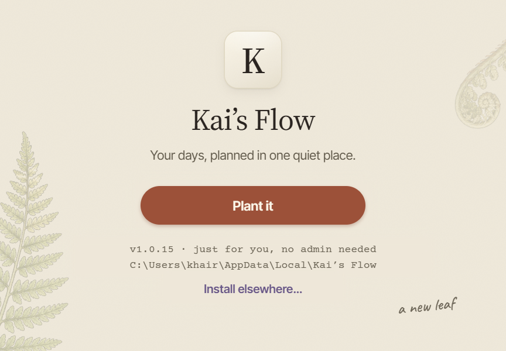
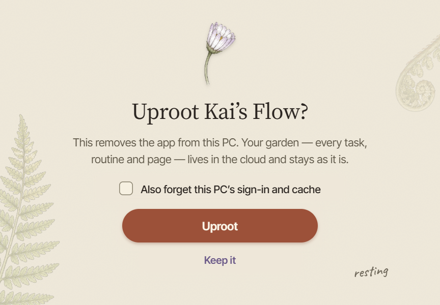

# An installer that looks like Kai's Flow

Kai (2026-10-03): "I want to heavily modify the installer and I want it to be our theme. I want it to completely look like us, not your average Windows installer."

Branch `claude/mobile-installer`, cut from c1b3446, with `origin/claude/wave-o` (8c24fef) merged in. Compared with wave-o, the branch changes only the installer's files. Not merged into master, not released.

## What changed

- **Our own NSIS template** (`app/src-tauri/installer/installer.nsi`).
  - It is Tauri's template for the CLI we use (tauri-cli v2.12.0). Every change is marked `Kai's Flow:`.
  - Everything Tauri relies on is unchanged:
    - the WebView2 bootstrap and the uninstaller
    - registry keys, shortcuts and the AppUserModelID
    - the `/P`, `/S`, `/UPDATE`, `/NS` and `/R` flags, and the old-binary migration
  - The changes are:
    - the page list
    - the title bar reads just "Kai's Flow"
    - one calm status line in place of the file-by-file log
    - the desktop shortcut is always created (Tauri's finish page offered it as a checkbox, ticked by default)
    - the install step moves on to the next page by itself
- **The theme** (`installer/kaisflow.nsh`). `tauri.conf.json` passes it in as `installerHooks`, which is the only way to give the template an absolute path. It holds all the page code:
  - **Pages:** every page fills the whole window. Its bottom layer is a bitmap rendered from HTML/CSS. On top of it sit only the parts that have to be live: the button label, links, the version and folder lines, our toggle, and the progress bar.
  - **Slots:** each live control sits in a "slot". In a slot the paper grain is lifted and replaced by its mean colour (`KF_SLOT_BG`), so the flat-painted control blends in.
  - **Stock buttons:** Back, Next and Cancel are still there, alive but hidden. **Enter is every page's main button, and Esc is Cancel.**
  - **Window:** it is sized to the art at the window's DPI (the template is PerMonitorV2-aware). On Windows 11 the title bar is linen with bark-coloured text (DWM caption colours).
  - **Fonts:** Inter Tight (SemiBold and Medium) and Courier Prime are loaded privately for this run (`AddFontResourceEx`, private flag). If they won't load, it falls back to Segoe UI and Consolas.
  - **Art:** GDI+ decodes the JPEGs. A scale we don't ship is resampled from the next larger one with high-quality bicubic.
- **The art** (`installer/pages/`, `installer/layout.nsh`). `design-integration/render_installer.mjs` builds both from the design system, with Playwright and the system Chrome (the same pattern as `render_app_icon.mjs`):
  - 6 pages × 100/125/150/200% as JPEG q90, about 0.95 MB in total
  - the toggle box, on and off, at the same four scales (PNG)
  - `layout.nsh` with the slot rectangles. This one file is the single source for the slot positions; NSIS reads them from it.
  - Re-run it with `node design-integration/render_installer.mjs`. Add `--previews` for the mockups.
- **Fonts** (`installer/fonts/`):
  - Inter Tight Medium and SemiBold, made from Google Fonts' variable TTF with the fontTools instancer
  - Courier Prime Regular
  - all three subset to Latin, about 50 KB each, with their `OFL-*.txt` licences
- **Config** (`tauri.conf.json` → `bundle.windows.nsis`): `template`, `installerHooks`, `installerIcon` and `uninstallerIcon` (the K, `icons/icon.ico`), and `installMode: currentUser`. `desktop.yml` is unchanged and still names the release file `kais-flow-<tag>-windows-setup.exe`.
- **The check** (`design-integration/installer_check.py`):
  - It renders the template the way tauri-bundler does and compiles it with the NSIS 3.11 that Tauri downloads. No Rust is involved.
  - The compiled exe is deleted unopened. **It never runs anything.**

## How it looks

These are **mockups**: `docs/log/assets/installer/mock-<page>-<100|150>.png`.

- They come from the same HTML the shipped art is rendered from, with the live parts drawn in.
- They show the window's client area only; the real window adds the linen title bar "Kai's Flow" on top.
- Live text in the real window is drawn by Windows (GDI) in the same fonts, so it may differ from the mockups by a pixel here and there.

| Page | What's on it |
|---|---|
| **Welcome** | The K app icon, "Kai's Flow" in Source Serif, the app's own line "Your days, planned in one quiet place.", and one terra pill. The pill reads **Plant it** for a fresh install, **Update** over an older version, and **Replant** over the same or a newer one. Under it, a mono line with the version (e.g. "v1.0.14 → v1.0.15 · your garden stays as it is"), a mono line with the folder (shortened with an ellipsis in the middle if it's long), and a lavender "Install elsewhere…" link that opens a folder picker. A faded fern bottom-left, a fiddlehead top-right, and "a new leaf" in Caveat. |
| **Planting** | A clover seedling, "Planting your garden…", "Unpacking Kai's Flow into your own user folder. It only takes a moment.", a flat moss progress bar on a pale track, and one mono status line. It moves on by itself. |
| **Planted ✿** | A cherry blossom, "Planted ✿", "It's in your Start menu and on your desktop. Sign in and your garden is right where you left it.", our toggle **Open Kai's Flow now** (on by default; click it or press Space), and a **Done** pill. |
| **Uproot Kai's Flow?** | An evening daisy, "This removes the app from this PC. Your garden — every task, routine and page — lives in the cloud and stays as it is.", the toggle "Also forget this PC's sign-in and cache" (off by default; it is Tauri's "delete app data"), an **Uproot** pill, and a "Keep it" link (Cancel). |
| **Uprooting…** | A closed daisy bud, "Lifting Kai's Flow out of this PC. Your garden stays safe in the cloud.", and the moss progress bar. |
| **Uprooted** | A fiddlehead, "Kai's Flow is gone from this PC; your garden is still in the cloud. Plant it again any time and sign in to pick up where you left off.", and a **Close** pill. |

## Evidence

- **CI is green.**
  - Run: [37109632274](https://github.com/khairyKY/kais-flow/actions/runs/37109632274) on head 25bf536.
  - `makensis` built `Kai’s Flow_1.0.0_x64-setup.exe` (30.25 MiB) from our template.
  - Artifact: **`kais-flow-25bf536-windows-setup.exe`**, 31.7 MB. The v1.0.14 release's was 30.7 MB, so about +1 MB for art and fonts.
  - The earlier runs 37097517501 (3ce2a77) and 37098436710 (871cc3a) were green too.
- **The real template compiles** with NSIS 3.11 via `python design-integration/installer_check.py`, with 2 warnings: an unused `un.KfLine`, and `WixMode` is never set because the reinstall page is gone.

### What happened on Kai's PC

Earlier in this session I compiled a preview build and walked its pages on this PC to screenshot them. Kai saw those windows (install → uninstall → install).

- **What ran:**
  - The preview build's install and uninstall steps were empty: no files, no registry, no shortcuts, and the app was never started.
  - Its only trace was a throwaway uninstaller in `%TEMP%`, which is gone.
  - I also opened the first CI build only as far as its Welcome page and cancelled it with Esc.
- **Kai's install is untouched.** I checked it read-only afterwards:
  - The HKCU uninstall key still says `DisplayVersion 1.0.14`.
  - `C:\Users\khair\AppData\Local\Kai’s Flow\kais-flow.exe` is still dated Oct 2 20:21.
  - Its uninstaller and the Start-menu and desktop shortcuts are dated Oct 3 01:23, before this session began.
- **That is now forbidden and removed:**
  - The harness is compile-only.
  - The `KF_PREVIEW` hooks are out of the template.
  - The screenshots are deleted.
- That run did catch one real bug: the first page the renderer drew (Welcome at 100%) had come out in fallback fonts. It is fixed in 871cc3a.

## Deviations

- **No reinstall page.** Tauri asked "uninstall the old version first?". Now a newer, same or older version just installs over the existing one, the way an update does. Welcome says which case it is.
- **No directory page.** "Install elsewhere…" opens the folder picker straight from Welcome and adds `\Kai's Flow` to the folder you pick.
- **The desktop shortcut is always made**, as Tauri's ticked checkbox did, and it still skips itself for `/UPDATE` and `/NS`. **"Open Kai's Flow now"** is our own toggle, not a Windows checkbox.
- **Source Serif 4 isn't bundled as a font file.** All serif text is baked into the art, rendered by Chrome. Only the fonts that live text needs ship.
- The licence, install-mode, start-menu and stock finish pages were removed. We ship `currentUser` with no licence, so none of them could show.
- **The previews are mockups**, not screenshots of the real window (see above).

## Risks

- **Nobody has seen the final build's pages on screen.** The CI build is green, but its pages have only been seen as mockups. Seeing them for real is Kai's first run (below).
- **Screen readers.** Titles and body text are pictures. The live controls have names (the pill label, links, toggle labels), but a screen reader can't read the pages' body text.
- **Tab order.** Tab reaches the toggles only. Links are deliberately not tab stops, because Enter anywhere means the main button and a focused "Keep it" must never be what Enter hits. So "Install elsewhere…" works by mouse only.
- **Moving between monitors.** If the window is dragged mid-run to a monitor with a different scale, the pages are not redrawn for it.
- **Windows 10** ignores the caption colours, so it shows the standard title bar. Everything else is the same.
- **If an install step fails**, the hidden Close button stays hidden, but Enter or the title bar's X still closes the window.
- **Picking a protected folder** like Program Files with "Install elsewhere…" fails without admin rights (it is a per-user install), and NSIS shows its own error box.
- **The template is pinned to tauri-cli 2.12.0.** When `@tauri-apps/cli` is bumped, diff upstream's `installer.nsi` against ours; the header says where it came from.

## How Kai tests it

1. Open the run: <https://github.com/khairyKY/kais-flow/actions/runs/37109632274>. Under **Artifacts**, download **`kais-flow-25bf536-windows-setup.exe`**. It comes zipped; unzip it.
2. Branch builds aren't version-stamped, so this one is **v1.0.0**:
   - Over your v1.0.14, its Welcome will say "v1.0.14 → v1.0.0 · an older version" with **Replant**.
   - Installing it replaces the app with this branch's build. Your garden is in the cloud and is not affected.
   - A real release built from this branch would say **Update**.
   - If you'd rather not swap out 1.0.14, run it on another PC, or wait for the next release.
3. Walk it: Welcome → Enter (or click the pill) → Planting → Planted (toggle "Open Kai's Flow now", then Done).
4. Try "Install elsewhere…" and Esc (Cancel) on Welcome.
5. The themed uninstaller exists only after installing a build that has it. Go to Settings → Apps → Kai's Flow → Uninstall. You'll get Uproot (toggle, **Uproot** / "Keep it") → Uprooting → Uprooted.
